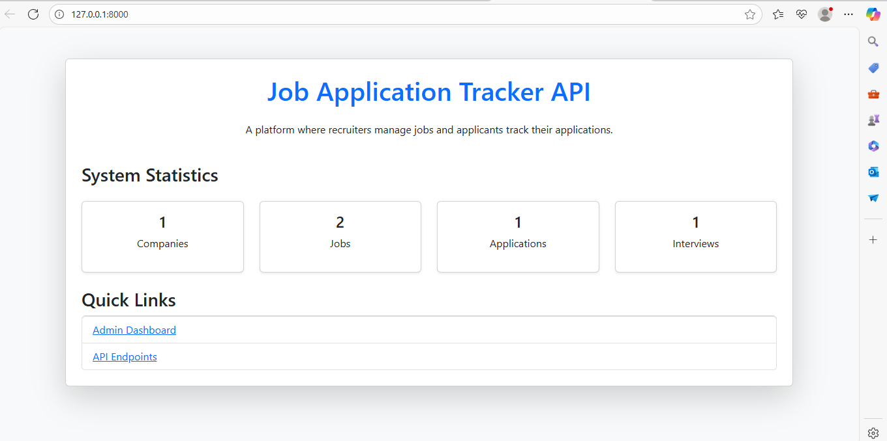
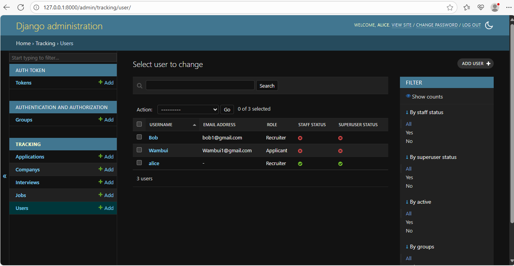
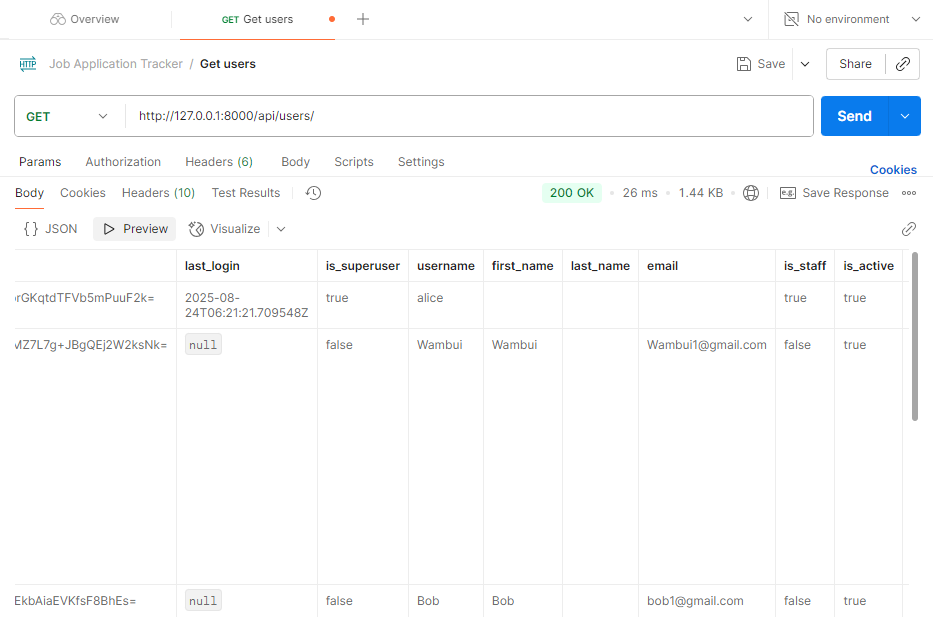
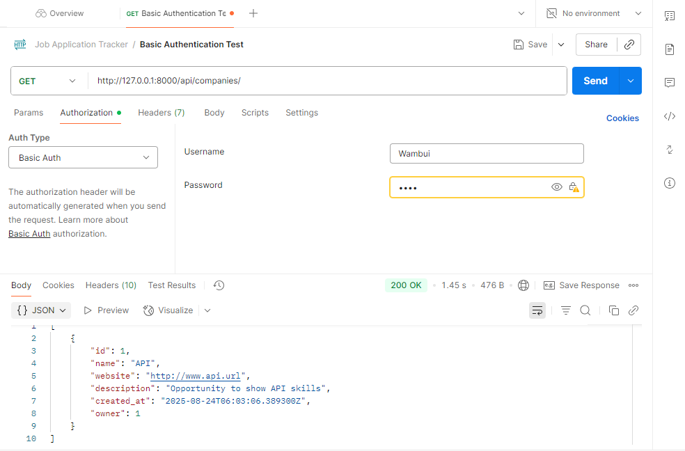
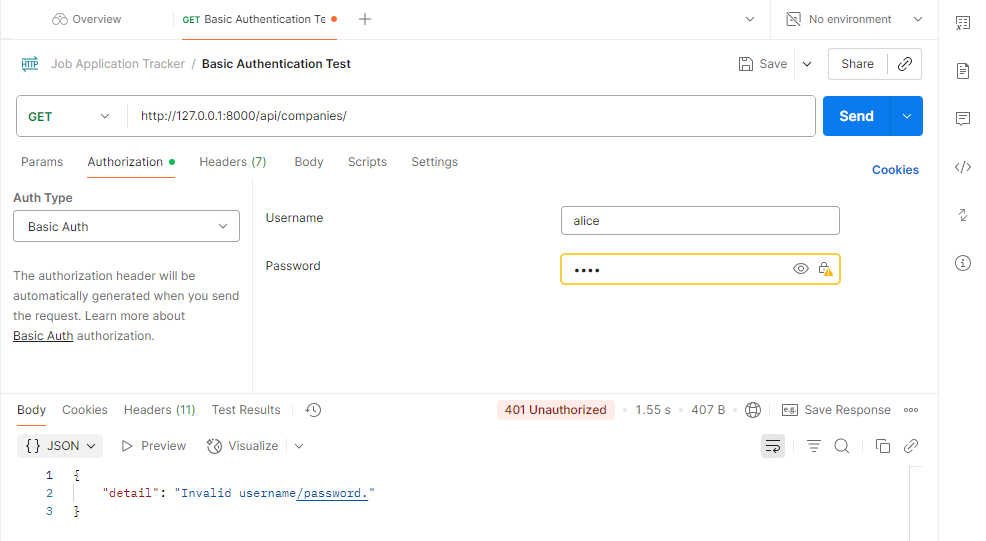
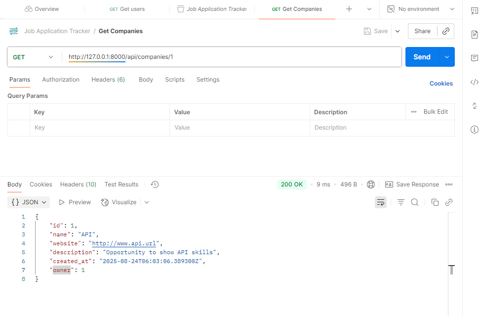
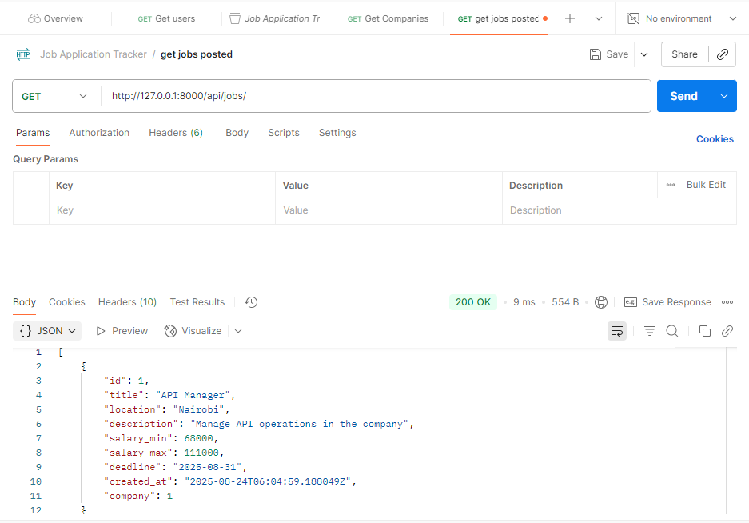
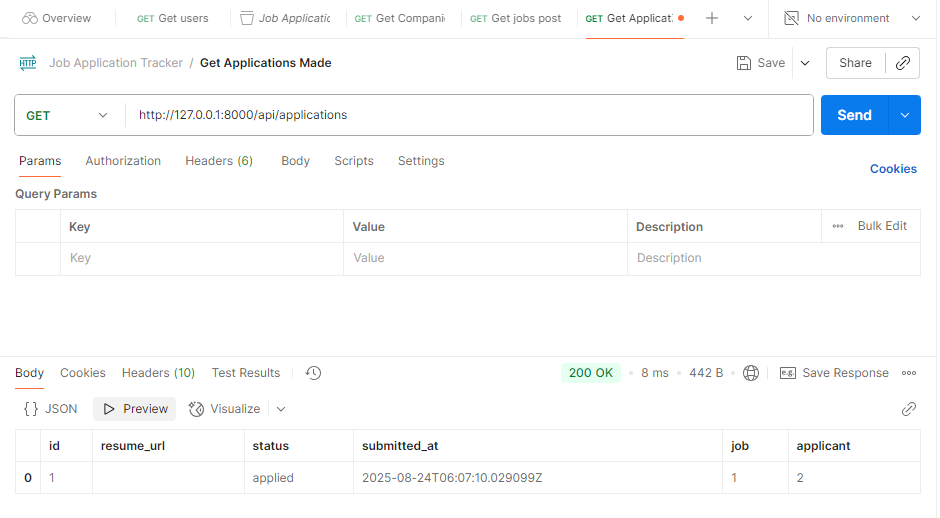
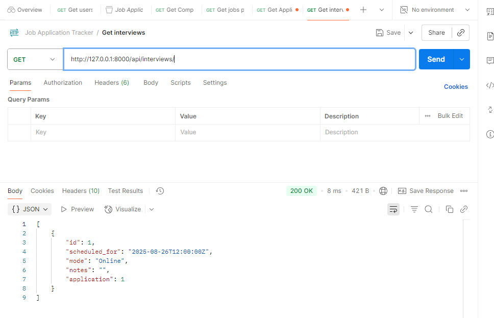
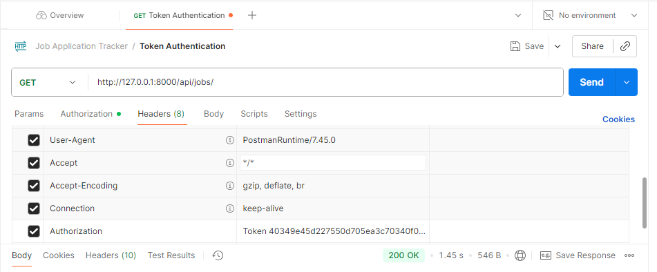

# Job Application Tracker API

A Django REST Framework project for managing job applications where recruiters can create companies and jobs, applicants can apply for jobs and attend interviews and admins oversee the whole system.

Here is the project home page:


---

## Group Members
- 149264 Mwaura Margaret Wambui
-  
- 

---

## ⚙️ Setup Instructions

### 1. Clone the repo
```bash
git clone https://github.com/MwauraMargaret/job-application-tracker-group8.git
cd job-application-tracker-group8
```

### 2. Create a virtual environment
```bash
python -m venv venv

source venv/bin/activate   # Linux/Mac
venv\Scripts\activate      # Windows
```

### 3. Install dependencies
```bash
pip install -r requirements.txt
```

### 4. Apply migrations
```bash
python manage.py makemigrations
python manage.py migrate
```

### 5. Create a superuser
```bash
python manage.py createsuperuser
```

### 6. Run the server
```bash
python manage.py runserver
```
Server will start at:
```cpp
http://127.0.0.1:8000/
```
---

## Project Details

### 1. Models & Relationships

- **User (Custom)** → extends `AbstractUser` with a `role` (`applicant` or `recruiter`)  
- **Company** → belongs to a recruiter (owner)  
- **Job** → belongs to a company  
- **Application** → links applicant → job with status (`applied`, `screening`, `interview`, `offer`, `rejected`)  
- **Interview** → linked to an application, stores date, mode, notes  

**Relationships:**
```pgsql
User (recruiter) ── owns ──> Company ── posts ──> Job
User (applicant) ── applies ──> Application ── relates to ──> Job
Application ── schedules ─> Interview
```
---

### 2. Serializers & Views

- **Serializers**: Convert models to JSON.  
  - `UserSerializer`  
  - `CompanySerializer`  
  - `JobSerializer`  
  - `ApplicationSerializer`  
  - `InterviewSerializer`  

- **Views (ViewSets)**: Provide CRUD APIs.  
  - `UserViewSet`  
  - `CompanyViewSet`  
  - `JobViewSet`  
  - `ApplicationViewSet`  
  - `InterviewViewSet`  

---

### 3. URLs

Base URL: `http://127.0.0.1:8000/`

- `/admin/` → Admin dashboard  
- `/api/users/` → Manage users (Admin only)  
- `/api/companies/` → Manage companies (Recruiters only)  
- `/api/jobs/` → List + create jobs (Recruiters create, Applicants view)  
- `/api/applications/` → Applicants apply, Recruiters view  
- `/api/interviews/` → Recruiters schedule interviews  

---

### 4. Testing Evidence

We tested the API using **Postman** and the **Django admin site**.  
Below are screenshots as proof of functionality and permissions.

---

### Admin Dashboard
Superuser (alice) logged into the admin site and can see all models:



---

### Users
Created users:
- `alice` (superuser)  
- `Bob` (recruiter)  
- `Wambui` (applicant)  



### Basic Authentication
With correct authentication details:


With incorrect authentication details:


---

### Companies
Successfull company profile created:




### Jobs
Successfull job posted:



---

### Applications
Applicant applies for a job:



---

### Interviews
Recruiter schedules an interview for an application:



---

### Token Authentication
1. Generate tokens via terminal:

```bash
python manage.py drf_create_token alice
python manage.py drf_create_token bob
python manage.py drf_create_token wambui
```
2. Test the tokens via Postman:
   

